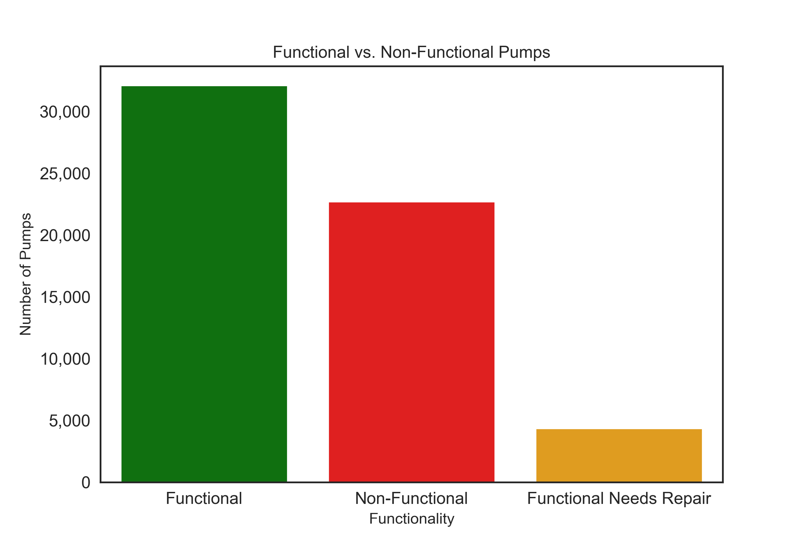

## Overview and Business Problem

Tanzania, as a developing country, struggles with providing clean water to its population of over 57,000,000. There are many water points already established in the country, but some are in need of repair while others have failed altogether.

We are a data science consulting company who has been hired by the Tanzanian Ministry of Water to create a model to help classify whether water pumps are functional, functional but in need of repairs, and non-functional. We have been hired to help improve maintenance operations minimize waste of the Ministry's resources and only send out repair teams to pumps that are potentially in need of repairs or are non-functional. While we want to maximize accuracy, we also want to maximize recall to ensure the people of Tanzania have access to potable water and few pumps that are non-functional or in need of repairs are over looked.

## Data Understanding

The data is sourced from Taarifa and the Tanzanian Ministry of Water. Data utilized can be found here: https://www.drivendata.org/competitions/7/pump-it-up-data-mining-the-water-table/data/

For the purposes of our evaluation, we are utilizing the Training Set Labels and Training Set Values, which include data from 59,400 pumps. Our cleaned data contains information from 59,028 pumps. Some of the features that are included in this dataset include location/geography data, installation data, as well as how the pumps are managed. 

We can see that our dataset has a class imbalance problem because the majority of the pumps are either functional or non-functional; we have very little data on pumps designated as functional but needing repair. The bar chart below shows this class imbalance:

## Modeling
For creating our final model to address this problem, we started with a selection of simpler classification models including Logistic Regression, K Nearest Neighbors, and Decision Tree Classifier. From there, we moved onto more complex options including Random Forest Classifier and XGBoost. Ultimately, we found that using a Stacking Classifier composed of a Random Forest Classifier and XGBoost performed the best through cross validation. The image below shows our CV scores for 5 folds for various models: 

### Rationale

Our rational for using a Stacking Classifier was to use the strengths of both a Random Forest Classifier and XGBoost in one model. We found that a default Random Forest Classifier and XGBoost both performed relatively well in a cross validation, so we combined these models into one using a Stacking Classifier. 

### Results

Our final Stacking Classifier model achieved an accuracy on unseen data of 79.0%. We found that our model correctly classified functional and non-functional water pumps better than pumps that were functional needing repair. This can be seen in the grouped bar chart below:

An overall report of the various classification metrics for our model on test data is shown below:

The confusion matrix confirms that our model performs best for functional and non-functional water pumps. One point of concern with our model is that the majority of misclassifications for pumps that are functional needing repair are that the pumps are functional. This means we would be overlooking select water pumps that need repair because our model classifies them as functional. The confusion matrix can be seen below:

### Limitations

Some limitations that we ran into include:
- Class Imbalance: there are very few data points with Function Needs Repair.
- Time to run models: running multiple GridSearchCV fits can take hours if not days.
- Lack of domain expertise: we are not well versed in what factors for water pumps contribute to its ability to function or not

### Next Steps

With more time and resources, here are a few next steps that we would like to pursue for this project:
- Treat problem as binary classification: given that a pump labeled "Functional needs Repair" could become non-functional at any time, we could label these pumps as non-functional. Thus, if our model predicts it is non-functional, a maintenance crew will still go check to pump to perform repairs.
- Further tune model: with more time, we could run more grid searches with more hyper parameters included. Some of these grid searches could take multiple days, so we would need significantly more time to optimize the final Stacking Classifier.
- Explore other models: in this project, we used Logistic Regression, KNN, Decision Tree Classifier, Random Forest Classifier, XGBoost, and Stacking Classifier models. We could look into other boosting models as well as simple neural networks to better predict our data set classes.
- Consult with a domain expert to achieve a better understanding of the water crisis plaguing Tanzania and how the functionality of water pumps relates to this issue. 

## Conclusion

## For More Information

See the full analysis in the [Data Cleaning Notebook](Notebooks/data_cleaning.ipynb) and the [Modeling Jupyter Notebook](Notebooks/modeling_notebook.ipynb) or review [this presentation](xxx.pdf).

For additional info, contact Jillian Clark or Zach Pollatsek as follows:

- Jillian: jlc0512@gmail.com
- Zach:    zacharypollatsek@gmail.com

## Repository Contents
- data
- images
- Working Notebooks
- .gitignore
- README.md
- xxx.pdf
- modeling_notebook.ipynb
- data_cleaning.ipynb